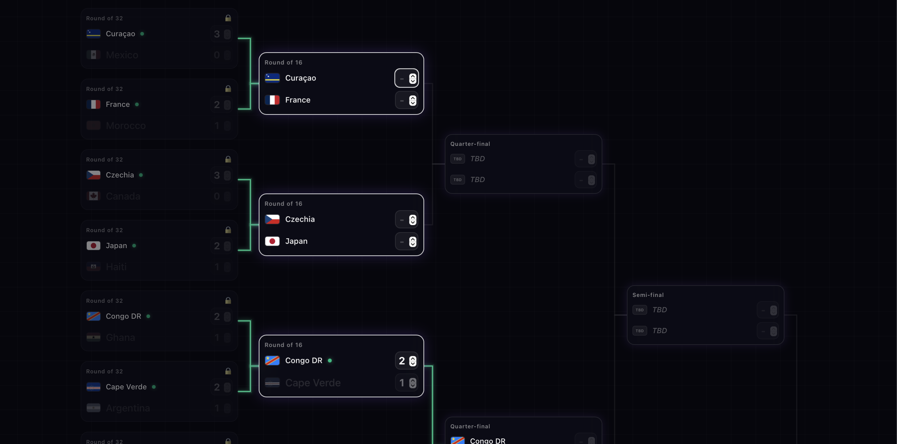
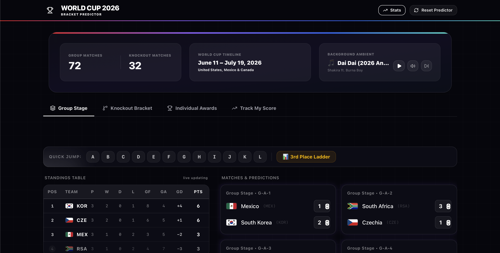
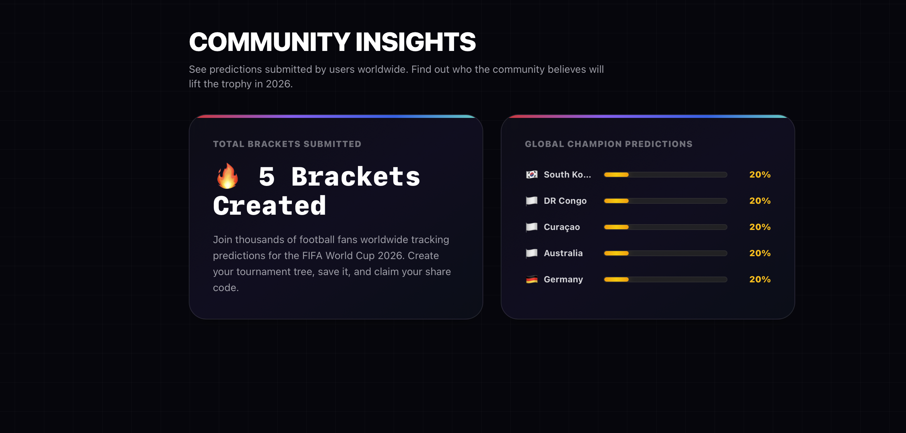
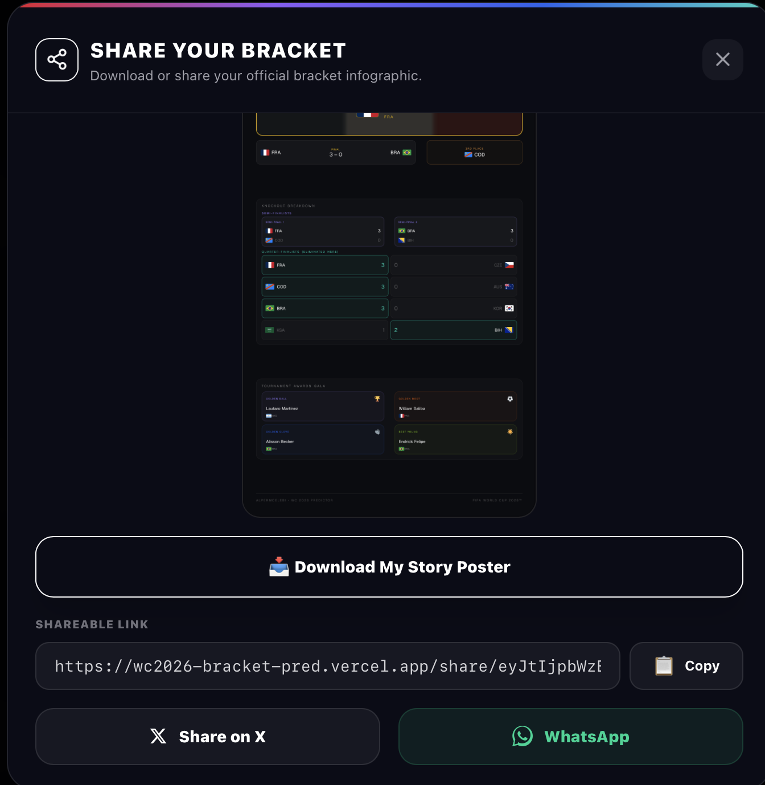

# 🏆 FIFA World Cup 2026 Bracket Predictor

A premium, interactive web application built with **Next.js**, **Tailwind CSS**, and **Supabase** that allows football fans to predict the entire Group Stage, third-place wildcards, Knockout brackets, and individual awards for the **FIFA World Cup 2026**. 

Users can download dynamic, auto-generated vertical story posters of their brackets, check global community statistics, and share their predictions directly to social media.

---

## 📸 Screenshots

> **[Main Dashboard Preview]**

> **[Premium Ambient Player & Header Metrics]**

> **[Global Community Stats Subpage]**

> **[Share Modal & Story Poster Preview]**

---

## ✨ Features

### 🌟 Interactive Tournament Simulator
* **Group Stage Builder**: Predict outcomes for all 72 group matches across 12 groups (A-L). Group standings, points, goals, and goal differences update in real-time.
* **Third-Place Wildcards**: Automatically computes and ranks the top 8 third-place teams based on FIFA rules to qualify for the Round of 32.
* **Knockout Bracket Tree**: Interactive elimination tree from the Round of 32 down to the Grand Final, complete with score tracking, penalty overrides, and visual paths.

### 🎵 Integrated Ambient Music Controller
* Fully integrated ambient player built directly into the header dashboard metrics panel.
* Track selection (anthems, mixes), play/pause toggles, and volume mute controls.
* Visual indicators, including a **subtle pulsing audio waveform micro-animation** and glowing borders when music is active.

### 📊 Community Insights & Statistics (`/stats`)
* Dedicated statistics portal showcasing global community metrics.
* **Global Participant Counter**: Dynamic counter showcasing total brackets submitted worldwide with an animated count-up ticker.
* **Champion Odds Grid**: Horizontal progress bars showing the top-predicted countries to win the Cup.
* **Performance Caching**: Powered by server-side caching (ISR) with a 5-minute revalidation layer to protect database read credits.

### 📥 Story Poster & Sharing Terminal
* **Dynamic Image Generation**: Generates high-quality, vertical (9:16) mobile-story infographic posters optimized for Instagram, WhatsApp, and TikTok via Vercel OG image compilation.
* **Advanced Web Share API**: Convert poster blobs into actual file objects to deep-link directly into native apps (X and WhatsApp) on supported mobile devices.
* **Copyable Templates**: Quick clipboard copying that bundles the unique sharing link and a custom Turkish promotional text template.

---

## 🛠️ Tech Stack

* **Framework**: [Next.js 15+ (App Router)](https://nextjs.org/)
* **Styling**: [Tailwind CSS](https://tailwindcss.com/)
* **Database**: [Supabase (PostgreSQL)](https://supabase.com/)
* **Icons**: [Lucide React](https://lucide.dev/)
* **State Management**: [Zustand](https://github.com/pmndrs/zustand)
* **Image Compilation**: `@vercel/og`

